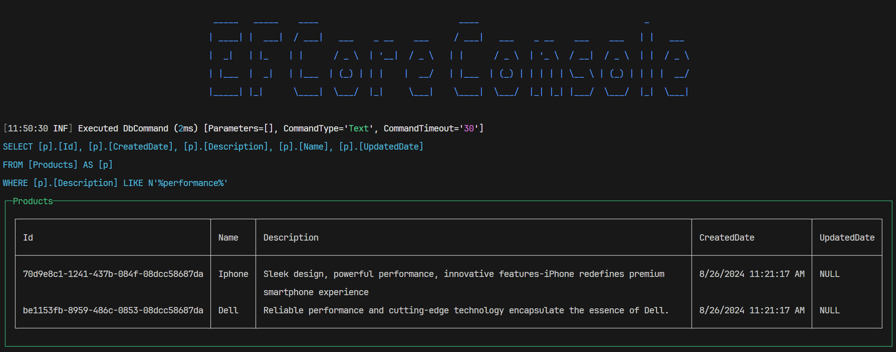

# Introduce

This project is a console application that demonstrates the usage of EFCore.


The project is created to demonstrate the concepts of EFCore, including:
* [x] Entity configuration
* [x] DbContext configuration
* [x] Navigation properties
* [x] Querying data
* [x] Saving data
* [x] Transactions
* [x] Change tracking
* [x] Value converters
* [x] Shadow properties
* [x] Owned types
* [x] Table splitting
* [x] Table-per-hierarchy inheritance
* [x] Table-per-type inheritance
* [x] Table-per-concrete-class inheritance
* [x] Query filters
* [x] Global query filters
* [x] Model caching
* [x] Connection resiliency
* [x] Connection pooling
* [x] Database providers
* [x] Logging
* [x] Diagnostics

## Folder Structure
The project has the following folder structure:
```sh
├───CodeTemplates
│   └───EFCore
├───Common
│   └───Console
├───DbContexts
├───Entities
├───Migrations
└───SeedingData
```

* `CodeTemplates`: This folder contains the code templates used by EFCore.
	+ `EFCore`: This folder contains the code templates used by EFCore.
* `Common`: This folder contains common classes used by the application.
	+ `Console`: This folder contains classes used by the console application.
* `DbContexts`: This folder contains the database context classes.
* `Entities`: This folder contains the entity classes.
* `Migrations`: This folder contains the database migrations.
* `SeedingData`: This folder contains the seeding data classes.

## Appsettings.json
The configuration for the application is stored in the `appsettings.json` file. The file has the following structure:

```json
    {
        "Database": {
            "Provider": 2,
            "ConnectionString": "Your_connection_string",
            "UseLazyLoadingProxies": true
        }
    }
```
The above JSON is used to configure the database provider and connection string for the application.
* `"Provider"`: This is the type of database provider to use.```{ SqlServer = 1, InMemory = 2}```.
* `"ConnectionString"`: This is the connection string to use for the database provider. You should replace `"Your_connection_string"` with the actual connection string for your database.
* `"UseLazyLoadingProxies"`: This is a flag to indicate whether to use lazy loading proxies. If set to true, then the application will use lazy loading proxies, otherwise it will not.
